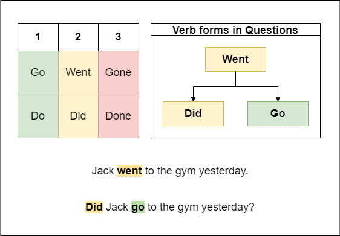

# Past Simple Cheat Sheet

## Основное:

1. В **Simple Past** всегда используется 2-ая форма глагола.
2. Если это _отрицание_ или _вопрос_ **чаще всего** добавляется вспомогательный глагол **to do**.
3. Если есть вспомогательный глагол то он используется во **2-ой** форме, а основной глагол используется в **1-ой** форме.

### Примеры:

- _Утверждение_ -> Jack **went** to the gym yesterday.
- _Отрицание_ -> Jack **did** _not_ **go** to the gym yesterday.
- _Вопрос_ -> **Did** Jack **go** to the gym yesterday?

## Глагол To Be:

| Лицо/Число  | Настоящее Время | Прошедшее Время |
| ----------- | --------------- | --------------- |
| I           | am              | was             |
| he, she, it | is              | was             |
| you, they   | are             | were            |

### 💡 Важно:

1. 🤓 **you** это и _ты_ и _вы_, по этому с **you** всегда используется **множественное число**.
2. ⭐️ глагол _was_ (_был_) это глагол _to be_ (_быть_) в **прошедшем времени**
3. ⭐️ _was/were_ используется чтобы в прошедшем времени описать **где мы были** или **в каком состоянии прибывали**.
4. ⭐️ глагол _to be/was_ это самостоятельный глагол который в рамках грамматики 🛑 **не** должен использоваться вместе с другими глаголами.

### ⭐️ Примеры:

- I **was** in school yesterday (где был).
- I **was** drunk yesterday (в каком состоянии находился).
- You **were** home yestery (где был).
- They **were** nervous on the exam yesterday (в каком состоянии находились).

### 🛑 Неправильное использование:

- I ~~was~~ **bought** a new TV yesterday (что сделал? -> **купил**, а не _где был_).
- We ~~were fly~~ **flew** to New Yourk last summer (что сделали? -> **летали**, а не _где были_).

---

[<<< Previous](./ASmallStory.md) | [Next >>>]
