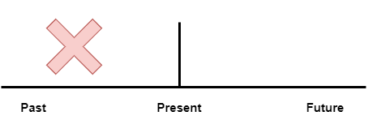

# Past Simple Sentence Examples.

Here you can see past simple sentence examples attached to a definite point in time.

In other words, explaining some action that started and finished at a specific time in the past.

### Examples:

1. We cooked a tasty dinner on the weekend.
2. The group of friends played D&D in 2007.
3. We watched TV yesterday.
4. Yesterday we waited for one hour for the concert to start.
5. Sarah said something about this last Tuesday.
6. The dog hid his bone this morning.
7. The players prepared for the game on Sunday.
8. You worked out on Thursday.
9. Jane knew that from the previous lecture.
10. I finished school in 2017.
11. This ship sailed across the ocean in 1981.
12. I lived in Norway in 2010.
13. She ran a marathon in March.
14. The Moon was red last night.
15. Sam studied English in 2010.
16. I went to the movies last month.
17. They uploaded the fix last week.
18. Joe worked at that company last year.
19. He had a nice lunch on Wednesday.
20. You traveled to Bali this autumn.

---

### Links:

[Simple Past](https://www.englishpage.com/verbpage/simplepast.html)

---

[<<< Previous](./PastSimple.md) | [Next >>>](./PastSimpleSeriesOfActionsExample.md)
