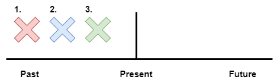

# Past Simple - Series of Completed Actions

We use the simple past to list a series of completed actions in the past. These actions happen 1st, 2nd, 3rd, 4th, and so on.

### Examples:

1. I finished work, walked to the beach, and found a nice place to swim.
2. He arrived from the airport at 8:00, checked into the hotel at 9:00, and met the others at 10:00.
3. Did you add flour, pour in the milk, and then add the eggs?
4. Did she wash the clothes, rinse, and then iron them?

---

### Links:

[Simple Past](https://www.englishpage.com/verbpage/simplepast.html)

---

[<<< Previous](./PastSimpleSentenceExamples.md) | [Next >>>](./PastSimpleWithBeSentenceExamples.md)
